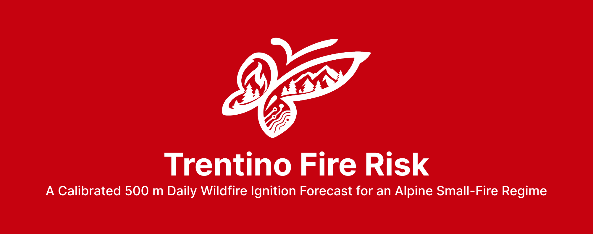

# Trentino Fire Risk

Daily wildfire ignition risk for the Autonomous Province of Trento, on a 500 m grid, for any date
from 1984 to ten days from today.

The provincial cadastre records 3,174 fires between 1984 and 2024. They are small: the median
event burns 0.134 ha and 92.1% stay under 5 ha, which puts most of the record below the detection
limit of the satellite products behind continental fire information systems. The operational
alternative, the Canadian Fire Weather Index, is a function of weather alone and cannot separate
two cells that share a weather grid point.

This project estimates, per cell and per day, the probability that a fire starts there. It learns
from 34,705 labeled cell-days carrying 139 features drawn from nine sources over 41 years, under the
constraint that every dynamic feature be obtainable from a weather forecast. On ten years held out
from tuning the model reaches 0.2735 AUPRC against 0.0812 for the fire weather indices alone, and
of the 276 recorded ignitions in those years none falls in the lowest danger class of the map its
own day was scored on.

## Clone

```
git clone https://github.com/damnicolussi/TrentinoFireRisk.git
cd TrentinoFireRisk
```

The clone carries the code, the configuration and the front end, and nothing else. `data/`,
`models/`, `reports/` and `dist/` are generated and appear as the pipeline runs. Serving the map
and rebuilding the model start from the same clone; what separates them is the input data below.

## Install

```
python -m venv .venv && source .venv/bin/activate
pip install -e ".[all]"
```

Python 3.11 or later. The geospatial packages ship binary wheels bundling GDAL and PROJ; if pip
fails to build them, install from conda-forge rather than hunting system libraries. The extras are
staged (`sources`, `models`, `viz`, `app`, `dev`) if a partial install is enough.

## Input data

Most of it is fetched by the pipeline itself: ERA5-Land, the Copernicus DEM, Landsat and WorldPop
through Earth Engine, OpenStreetMap through osmnx, the forecast through Open-Meteo. The rest is
files, placed under `data/raw` before the first run.

| Path | Where it comes from |
|---|---|
| `data/raw/pat_fires/Incendi__date.shp` | Fire cadastre, Servizio Foreste PAT (`serv.foreste@provincia.tn.it`). Open data, but not published for download: ask for it. |
| `data/raw/pat_boundary/ammprv_v.shp`, `data/raw/pat_hydro/idrspacq.shp`, `data/raw/natura2000/Habitat_2019.shp` | Provincial boundary, hydrography and Natura 2000 network, SIAT geoportal, open data |
| `data/raw/corine/clc-1990`, `clc-2000`, `clc-2006`, `clc-2012`, `clc-2018` | CORINE Land Cover, five editions, [land.copernicus.eu](https://land.copernicus.eu/en/products/corine-land-cover), free account. The GeoTIFF inside each edition is named in `corine.editions` in `config/config.yaml`. |
| `data/raw/mesogeos/positives.csv`, `negatives.csv` | Mesogeos fire-danger tracks, [Orion-AI-Lab/mesogeos](https://github.com/Orion-AI-Lab/mesogeos), CC BY |

A shapefile travels as a set: the `.shx`, `.dbf` and `.prj` come with the `.shp`.

Earth Engine authenticates once per machine, against a Cloud project of your own with the Earth
Engine API enabled:

```
earthengine authenticate
```

Set `sources.gee_project` in `config/config.yaml` to that project. The value in the repository is
the author's and will not authorize anyone else. Serving a prediction needs none of this; building
the dataset does.

```
tfire check-access
```

verifies credentials and connectivity for every remote source and names whichever one fails. It
does not look at the four local inputs; a missing one surfaces as a `FileNotFoundError` naming the
path when the verb that reads it runs.

## Pipeline

Each verb writes its output under `data/` and skips work that already exists unless given
`--force`.

```
tfire build-grid                    # 500 m grid over the provincial boundary, EPSG:25832
tfire build-positives               # ignition points from the PAT cadastre
tfire build-samples                 # labels and the 1:10 case-control negatives
tfire fetch-era5                    # hourly ERA5-Land backbone, 1984 to present
tfire fetch-landsat                 # monthly Landsat composites, five sensors harmonized
python scripts/crop_corine.py        # the five CORINE editions, cropped to the province
tfire extract-features              # all nine categories; --category to select
tfire build-dataset                 # join into the training table
tfire train-mesogeos                # stacking base model on the Mesogeos tracks
tfire build-dataset --force         # again, to pick up mesogeos_prob
tfire train                         # XGBoost, Optuna, blocked CV, plus the baselines
tfire evaluate                      # metrics, SHAP, calibration, danger classes, figures
tfire fit-bias-map                  # puts remotely served weather back on the backbone
tfire verify-events                 # scores every day that carries a recorded ignition
```

`evaluate` writes the calibrator and the danger-class breaks, so it has to follow `train` and not
the other way round. `--sensitivity all` adds the five sensitivity analyses and takes about
twenty-five minutes.

Then a prediction for one date, or a range:

```
tfire predict 2024-08-12
tfire predict 2026-08-21 --days 10
```

## Running the service

The image carries the code, never the data. The subset a prediction actually opens is assembled
separately:

```
tfire package-runtime --out dist/runtime
```

About 1.1 GB in 26 entries. It walks the paths a prediction and the API open, checks they exist,
and fails naming whatever is missing rather than producing a container that starts and then answers
500. A shapefile travels as a set, so the siblings of any `.shp` come along.

```
cp .env.example .env
tfire admin-password                # prints the TFIRE_ADMIN_PASSWORD line to paste into .env
printf 'TFIRE_UID=%s\nTFIRE_GID=%s\n' "$(id -u)" "$(id -g)" >> .env
docker compose up -d
curl -fsS http://127.0.0.1:8000/healthz
```

The uid matters. The container writes risk maps, overlays and job logs into the mounted directory,
so it has to run as whoever owns that directory on the host. Left at the image's own 10001 against
a host-owned directory, every on-demand date fails on a permission error while `/healthz` still
answers 200. `/healthz` returns the active model version, so a 200 with the version you expect is
the check that the mounts resolved.

Then ask for a date the cached tables do not cover, which is the check `/healthz` does not make:

```
curl -fsS "http://127.0.0.1:8000/api/risk/$(date -d +2days +%F)" > /dev/null
```

A date inside the stored record is served from the cached meteorology. A future date rebuilds the
fire weather indices through xclim, which compiles with numba, which writes a cache; the image
points `NUMBA_CACHE_DIR` at a writable path, because otherwise numba tries to write beside its own
source and every forecast date answers 500 while historical dates keep working.

Keep uvicorn at one worker. The sessions, the single job slot, the per-date locks and the rate
counters all live in the process, so a second worker would answer with a different half of that
state. `tfire serve` fixes it; do not put a forking process manager in front of it.

`docker compose --profile public up -d` adds a Caddy reverse proxy on 80 and 443, which terminates
TLS and obtains a certificate for `TFIRE_DOMAIN` on its own. Without the profile the stack is the
application alone on the loopback, which is what local use needs. Before a public URL, set
`app.uncached_requests_per_hour` above 0 in `config/config.yaml`: it is disabled by default because
stepping day by day through the record hits far more uncached dates than any limit would allow.

## Operating it

Without `TFIRE_ADMIN_PASSWORD` the admin surface refuses every request with 503, which is the
intended state when nobody needs to operate it remotely. The map does not depend on it.

Behind the password, the drawer shows data freshness, the available model versions and a job runner
that executes CLI verbs as subprocesses, one at a time.

| Action | Runs | Reads beyond the packaged subset |
|---|---|---|
| `predict` | one date | nothing |
| `warm` | the whole warm window | nothing |
| `refresh-vegetation` | a prediction that refetches the Landsat composite | Earth Engine credentials |
| `refresh-era5` | `fetch-era5`, then the meteo and FWI extracts | Earth Engine credentials, `data/raw/era5land` |
| `rebuild-dataset` | `build-dataset --force` | the labeled samples and the feature tables |
| `retrain` | `train --force`, then `evaluate --force --sensitivity all` | writes into `reports/figures` |

Every action is offered whenever a job slot is free; a missing prerequisite comes back as a failed
job with the reason in the log rather than as a disabled button. The last four are satisfied only
where the working tree is mounted, which is what the path variables in `.env` are for: set them and
the same service reads `data/`, `models/` and a writable `reports/` in place of the packaged
subset, with the Earth Engine credentials the two refresh actions authenticate with.

```
printf 'TFIRE_DATA_DIR=./data\nTFIRE_MODELS_DIR=./models\nTFIRE_REPORTS_DIR=./reports\n' >> .env
printf 'TFIRE_EE_DIR=%s\n' "$HOME/.config/earthengine" >> .env
docker compose up -d --force-recreate
```

Keep that off a public deployment: it exposes the whole 5.4 GB tree, and a set of credentials, to a
process behind the proxy.

Model versions are directories under `models/trentino/`. One holding `model.json`, `metrics.json`
and `calibrator.json` is offered in the version picker, and the choice survives a restart. Every
risk map carries a fingerprint of the estimator and the calibrator it was scored with, so rolling
back is picking the previous version: maps scored with the other one are stale by fingerprint and
get recomputed on request.

## What is not in the repository

`data/`, `models/` and `reports/` are generated, and are ignored by git. So is `dist/runtime/`, the
packaged subset. Reproducing the results means the local inputs, Earth Engine credentials and the
pipeline above, in that order; `requirements.lock.txt` pins the environment that produced the
shipped model.

## Tests

```
pytest -q
ruff check . && ruff format --check .
mypy
```

## License

MIT. See `LICENSE`. The data sources carry their own licenses, listed in the thesis appendix and on
the application's project page.
